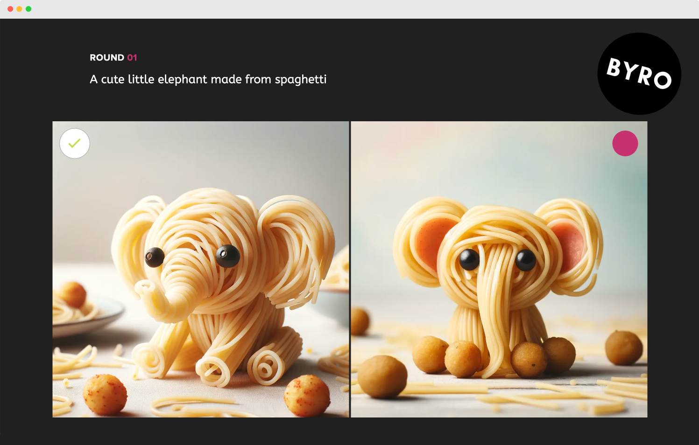

# PromptDeck: Simple web-app to run prompt battles

---
PromptDeck is an easy-to-use, simple and flexible solution to run your own image-based prompt battle events with a crystal clear, beautiful UI.

It uses a simple XLSX-file (Excel) for round based informations and Dropbox API for file storage.

*Image vote screen*

## How to set up

---

1. Make sure you fulfill the Laravel 11 Framework [server requirements](https://laravel.com/docs/11.x/deployment#server-requirements)
2. Generate your authorisation token in the [App Console](https://www.dropbox.com/developers/apps). Read the [Dropbox Developer Blog](https://dropbox.tech/developers/generate-an-access-token-for-your-own-account) to see how to get yours.
3. Set your API key in .env `DROPBOX_AUTHORIZATION_TOKEN`
3. Set-up your round informations in `/storage/app/public/battles.xlsx` (see below )
4. Set-up your file structure on Dropbox (see below )
5. You're good to go

## How it works

---
It's build to run with two counterparts for each round. After each round, the winner is marked in the battle list and the next round will start.

1. Display a prompt-quest to the actors
2. Run down a timer (for 1 minuts e.x.)
3. The actors must place their image (only one) in the appropriate  Dropbox round folder. 
3. Display the picture side by side
4. Vote for a picture
5. Start the next round

## Datasource

---
The data source is set up on a XLSX-file (Excel), because all in our tem can handle it (instead of a database). You're totaly free to implement your own data source. It's implemented using a very simple repository pattern. Yout just need to implement the `App\Contracts\Repository` interface to build your own.

#### XLSX structure

Find the example file under `storage/app/public/battles.xlsx`. After each round the finished_at flag is set and the winner is highlighted in bold.

| Column     | Description                                                                                       |
|-------------|---------------------------------------------------------------------------------------------------|
| round       | Contains the round number. For example, you have an quilfication round (1) and a finale round (2) |
| battle      | Continuous number of battles                                                                      |
| prompt      | The prompt quest that will be displayed to the prompters.                                         |
| actor_whie  | First prompter                                                                                    |
| actor_red   | Second prompter                                                                                   |
| finished_at | Timestamp set automatically when the round ends (after voting)                                                                                    |

#### Custom structure
If you like to define your own column structure, you can configure the relevant column settings in `config/promptdeck.php`

## Artwork file storage

---
In the root folder of your Dropbox app, create the actor folders named "white" and "red". In it, create subfolders with a leading zero numeration of your battle rounds (e.g. 01, 02, 03, ...).